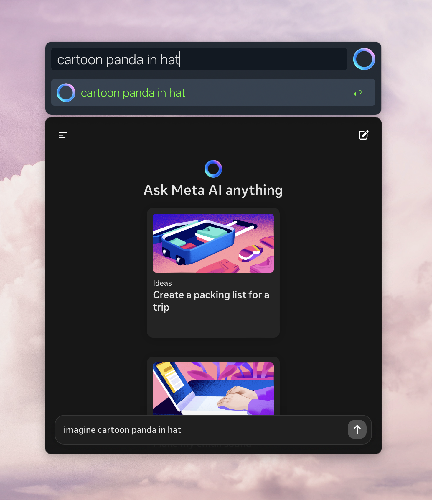
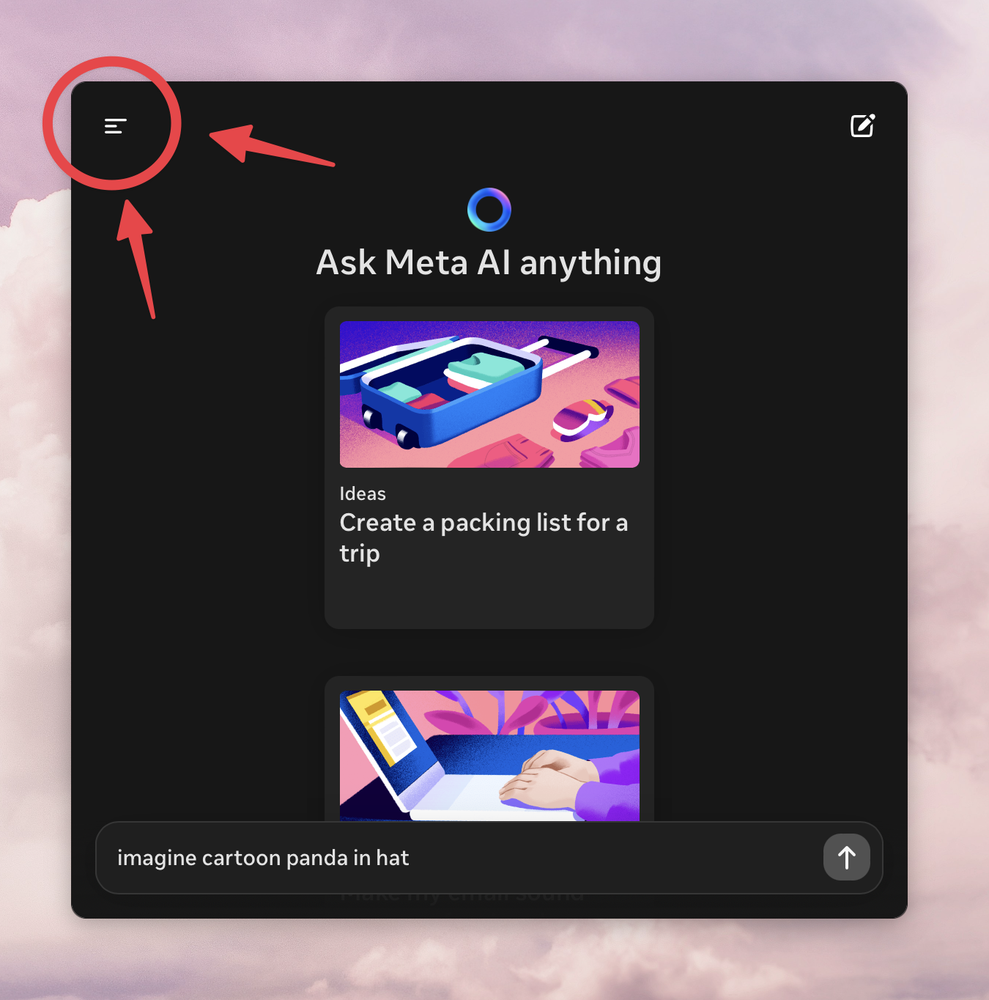
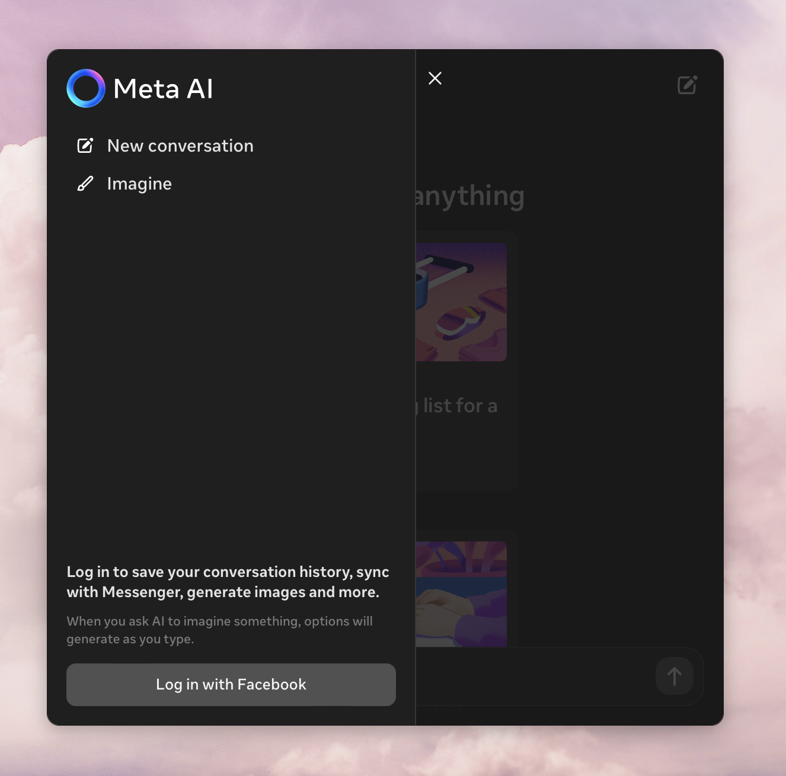

<h1 align="center">
  <br/>
  Meta AI Flash Imagine
</h1>

Generate images as you type using [Meta AI](https://www.meta.ai) in
[Alfred](https://alfredapp.com).

<div align="center">
    <br/>
</div>

## Installation
Run the following command in terminal:
```shell
curl -sL https://raw.githubusercontent.com/mr-pennyworth/alfred-meta-ai-flash-imagine/main/install.sh | sh
```

## First Use: Facebook Login
Running the workflow for the first time, we see that the query is being typed
into the text box, but the image isn't showing up:


Meta AI requires you to log in to generate images. Click on icon in the top
left corner of the pane, and log in to Meta AI:


